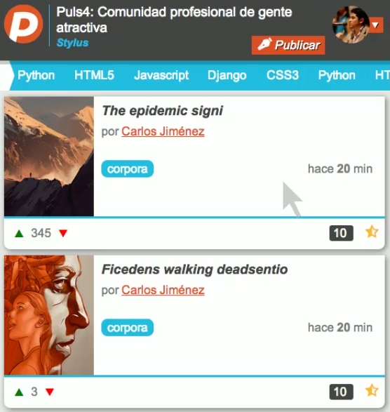

# Real-time article posting

Application that allow users to post articles in real time. Designed and implemented using NodeJs and Backbone.js.


# Installation

### Install node modules and build the app

```
npm install
```

### Run the server

```
python server.js
or
supervisor server.js
```

### Open your browser and paste this url

```
http://localhost:3000/
```

### Screenshot



### Interesting links

[Backbone](backbonejs.org)
[Tutorial de backbone](https://github.com/addyosmani/backbone-fundamentals/blob/gh-pages/backbone-fundamentals.md)
[Backbone generate](https://github.com/posabsolute/backbone_generate)
[Grunt.js](http://gruntjs.com/getting-started)


### License

MIT
